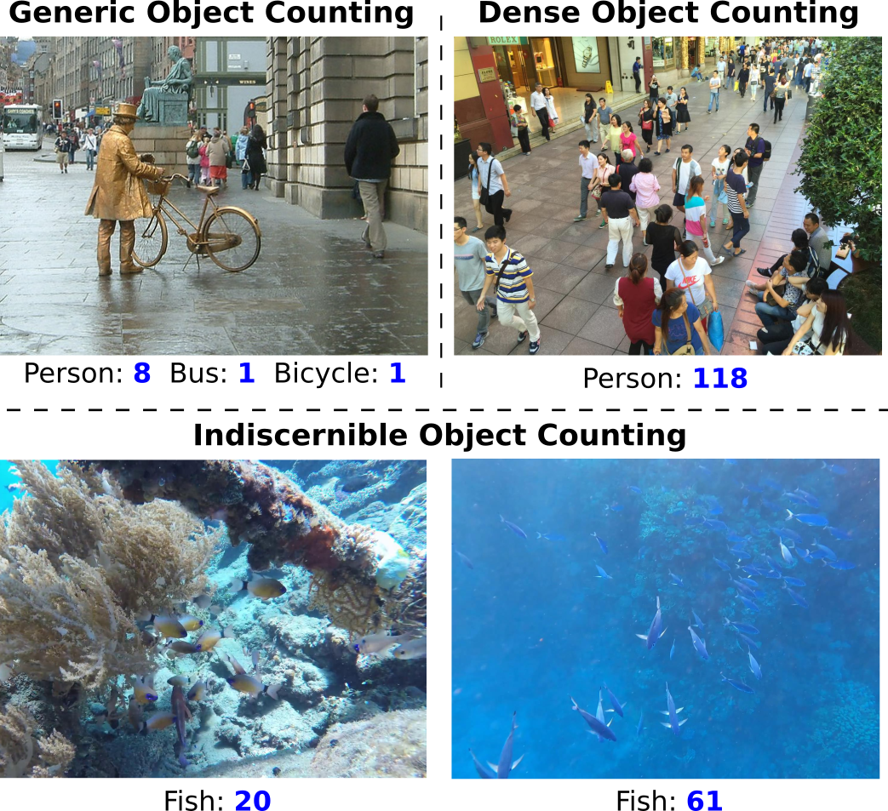

# Indiscernible Object Counting in Underwater Scenes (CVPR2023)

> Authors:
> [Guolei Sun](https://guoleisun.github.io/), 
> [Zhaochong An](https://1170801121.github.io/), 
> [Yun Liu](https://yun-liu.github.io/), 
> [Ce Liu](https://vision.ee.ethz.ch/people-details.MjYzNDA1.TGlzdC8zMjg5LC0xOTcxNDY1MTc4.html), 
> [Christos Sakaridis](https://people.ee.ethz.ch/~csakarid/), 
> [Deng-Ping Fan](https://dengpingfan.github.io/),
> [Luc Van Gool](https://ee.ethz.ch/the-department/faculty/professors/person-detail.OTAyMzM=.TGlzdC80MTEsMTA1ODA0MjU5.html).

## 1. Object Counting Tasks
The existing object counting tasks include: Generic Object Counting (GOC), and Dense Object Counting (DOC). In this paper, we propose a new challenging termed "Indiscernible Object Counting (IOC)", which focuses on counting foreground objects in indiscernible scenes. The comparisons between different tasks are shown in the following figure.
<p align="center">
     <br />
    <em> 
    Figure 1: Illustration of different counting tasks. Top left: Generic Object Counting (GOC), which counts objects of various classes in natural scenes. Top right: Dense Object Counting (DOC), which counts objects of a foreground class in scenes packed with instances. Down: Indiscernible Object Counting (IOC), which counts objects of a foreground class in indiscernible scenes. Can you find all fishes in the given examples? For GOC, DOC, and IOC, the images shown are from PASCAL VOC, ShanghaiTech, and the new IOCfish5K dataset, respectively.
    </em>
</p>

Due to a lack of appropriate IOC datasets, we present a large-scale dataset IOCfish5K which contains a total of 5,637 high-resolution images and 659,024 annotated center points. Underwater scenes contain many indiscernible objects (Sea Horse, Reef Stonefish, Lionfish, and Leafy Sea Dragon) because of limited visibility and active mimicry. Hence, we focus on underwater scenes for our dataset. 

## 2. The Proposed Dataset
Our dataset can be downloaded from [here](https://drive.google.com/file/d/1ETY_AdJB9azzja6L9URN58KtL4OH98SL/view?usp=sharing).
The annotations are in xml format. Each object instance is annotated by a point (x,y coordinates). The point annotation in xml is as follows:
```
    <object>
        <point>
            <x>x_coor</x>
            <y>y_coor</y>
        </point>
    </object>
```

## 3. Benchmarking

### 4.1. Overview

### 4.2. Usage

## 4. The Proposed Method

### 4.1. Overview

### 4.2. Usage

## 5. Results

### 5.1. Quantitative Results

### 5.2. Qualitative Results

## 6. Citations
```bibtex
@inproceedings{sun2023ioc,
    title={Indiscernible Object Counting in Underwater Scenes},
    author={Sun, Guolei and An, Zhaochong and Liu, Yun and Liu, Ce and Sakaridis, Christos and Fan, Deng-Ping and Van Gool, Luc},
    booktitle={Proceedings of the IEEE/CVF International Conference on Computer Vision and Patern Recognition (CVPR)},
    year={2023}
}
```
## 7. Contact
- Guolei Sun, sunguolei.kaust@gmail.com
