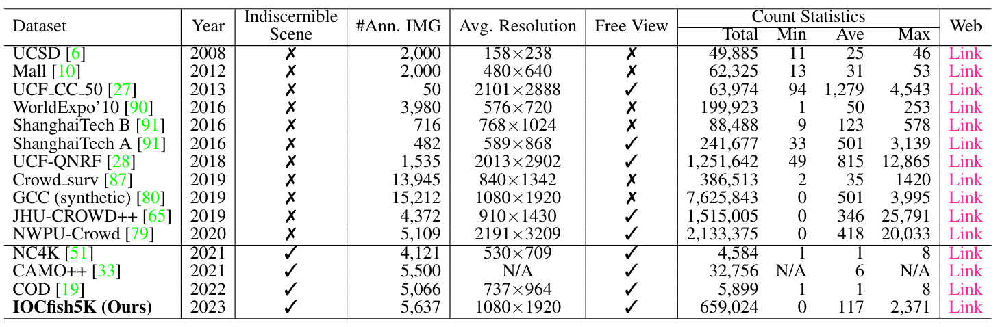

# Indiscernible Object Counting in Underwater Scenes (CVPR2023)
> [Paper](https://arxiv.org/abs/2304.11677) [Supp](https://openaccess.thecvf.com/content/CVPR2023/supplemental/Sun_Indiscernible_Object_Counting_CVPR_2023_supplemental.pdf) [Poster](https://docs.google.com/presentation/d/1Fj_lPBqFkZLkmaRHIIWIk-9gi7x0eKUh/edit?usp=sharing&ouid=109860074576125304916&rtpof=true&sd=true)

> Authors:
> [Guolei Sun](https://guoleisun.github.io/), 
> [Zhaochong An](https://zhaochongan.github.io), 
> [Yun Liu](https://yun-liu.github.io/), 
> [Ce Liu](https://vision.ee.ethz.ch/people-details.MjYzNDA1.TGlzdC8zMjg5LC0xOTcxNDY1MTc4.html), 
> [Christos Sakaridis](https://people.ee.ethz.ch/~csakarid/), 
> [Deng-Ping Fan](https://dengpingfan.github.io/),
> [Luc Van Gool](https://ee.ethz.ch/the-department/faculty/professors/person-detail.OTAyMzM=.TGlzdC80MTEsMTA1ODA0MjU5.html).

## 1. Object Counting Tasks
The existing object counting tasks include: Generic Object Counting (GOC), and Dense Object Counting (DOC). In this paper, we propose a new challenge termed "Indiscernible Object Counting (IOC)", which focuses on counting foreground objects in indiscernible scenes. The comparisons between different tasks are shown in the following figure.
<p align="center">
     <br />
    <em> 
    Figure 1: Illustration of different counting tasks. Top left: Generic Object Counting (GOC), which counts objects of various classes in natural scenes. Top right: Dense Object Counting (DOC), which counts objects of a foreground class in scenes packed with instances. Down: Indiscernible Object Counting (IOC), which counts objects of a foreground class in indiscernible scenes. Can you find all fishes in the given examples? For GOC, DOC, and IOC, the images shown are from PASCAL VOC, ShanghaiTech, and the new IOCfish5K dataset, respectively.
    </em>
</p>

Due to a lack of appropriate IOC datasets, we present a large-scale dataset IOCfish5K which contains a total of 5,637 high-resolution images and 659,024 annotated center points. Underwater scenes contain many indiscernible objects (Sea Horse, Reef Stonefish, Lionfish, and Leafy Sea Dragon) because of limited visibility and active mimicry. Hence, we focus on underwater scenes for our dataset. 

## 2. The Proposed Dataset
The comparisons between our dataset and existing datasets are shown below.
| Dataset          | Year | Indiscernible Scene | #Ann. IMG | Avg. Resolution | Free View | Total Count | Min Count | Ave Count | Max Count |  Web |
|------------------|:----:|:-------------------:|:---------:|:---------------:|:---------:|:-----------:|:---------:|:---------:|:---------:|:----:|
| UCSD             | 2008 |      &cross;        |   2,000   |     158x238     |  &check;  |    49,885   |     11    |     25    |     46    | [Link](http://www.svcl.ucsd.edu/projects/peoplecnt/) |
| Mall             | 2012 |      &cross;        |   2,000   |     480x640     |  &cross;  |    62,325   |     13    |     31    |     53    | [Link](http://personal.ie.cuhk.edu.hk/~ccloy/downloads_mall_dataset.html) |
| UCF_CC_50        | 2013 |      &cross;        |     50    |    2101x2888    |  &check;  |    63,974   |     94    |   1,279   |   4,543   | [Link](http://crcv.ucf.edu/data/ucf-cc-50/) |
| WorldExpo'10     | 2016 |      &cross;        |   3,980   |     576x720     |  &cross;  |   199,923   |     1     |     50    |    253    | [Link](http://www.ee.cuhk.edu.hk/~xgwang/expo.html) |
| ShanghaiTech B   | 2016 |      &cross;        |    716    |     768x1024    |  &cross;  |    88,488   |     9     |    123    |    578    | [Link](https://github.com/desenzhou/ShanghaiTechDataset) |
| ShanghaiTech A   | 2016 |      &cross;        |    482    |     589x868     |  &check;  |   241,677   |     33    |    501    |   3,139   | [Link](https://github.com/desenzhou/ShanghaiTechDataset) |
| UCF-QNRF         | 2018 |      &cross;        |   1,535   |    2013x2902    |  &check;  |  1,251,642  |     49    |    815    |   12,865  | [Link](https://www.crcv.ucf.edu/data/ucf-qnrf/) |
| Crowd_surv       | 2019 |      &cross;        |   13,945  |     840x1342    |  &cross;  |   386,513   |     2     |     35    |    1420   | [Link](https://ai.baidu.com/broad/introduction) |
| GCC (synthetic)  | 2019 |      &cross;        |   15,212  |    1080x1920    |  &cross;  |  7,625,843  |     0     |    501    |   3,995   | [Link](https://mailnwpueducn-my.sharepoint.com/:f:/g/personal/gjy3035_mail_nwpu_edu_cn/Eo4L82dALJFDvUdy8rBm6B0BuQk6n5akJaN1WUF1BAeKUA?e=ge2cRg) |
| JHU-CROWD++      | 2019 |      &cross;        |   4,372   |     910x1430    |  &check;  |  1,515,005  |     0     |    346    |   25,791  | [Link](http://www.crowd-counting.com/) |
| NWPU-Crowd       | 2020 |      &cross;        |   5,109   |    2191x3209    |  &check;  |  2,133,375  |     0     |    418    |   20,033  | [Link](https://gjy3035.github.io/NWPU-Crowd-Sample-Code/) |
| NC4K             | 2021 |      &check;        |   4,121   |     530x709     |  &check;  |    4,584    |     1     |     1     |     8     | [Link](https://github.com/JingZhang617/COD-Rank-Localize-and-Segment) |
| CAMO++           | 2021 |      &check;        |   5,500   |       N/A       |  &check;  |    32,756   |    N/A    |     6     |    N/A    | [Link](https://sites.google.com/view/ltnghia/research/camo_plus_plus) |
| COD              | 2022 |      &check;        |   5,066   |     737x964     |  &check;  |    5,899    |     1     |     1     |     8     | [Link](https://github.com/DengPingFan/SINet) |
| IOCfish5K (Ours) | 2023 |      &check;        |   5,637   |    1080x1920    |  &check;  |   659,024   |     0     |    117    |   2,371   | [Link](https://github.com/GuoleiSun/Indiscernible-Object-Counting) |
<p align="center">
<!--      <br /> -->
    <em> 
    Table 1: Statistics of existing datasets for dense object counting (DOC) and indiscernible object counting (IOC).
    </em>
</p>

Our dataset can be downloaded from [here](https://drive.google.com/file/d/1ETY_AdJB9azzja6L9URN58KtL4OH98SL/view?usp=sharing). It is organized as follows:
```
    IOCfish5K
    ├── images
        ├──****.jpg
        ├──****.jpg
    ├── annotations
        ├──****.xml
        ├──****.xml
    ├── train_id.txt
    ├── val_id.txt
    ├── test_id.txt
```
The image ids for train/val/test are in ```train_id.txt```, ```val_id.txt```, and ```test_id.txt```, respectively.
  
The annotations are in xml format. Each object instance is annotated by a point (x,y coordinates). The point annotation in xml is as follows:
```
    <object>
        <point>
            <x>x_coor</x>
            <y>y_coor</y>
        </point>
    </object>
```

## 3. Benchmarking

### 3.1. Overview
For benchmarking purposes, we select 14 mainstream methods for object counting and carefully evaluate them on IOCfish5K.

### 3.2. Usage
To do

## 4. The Proposed Method

### 4.1. Overview
we propose IOCFormer, a new strong baseline that combines density and regression branches in a unified framework and can effectively tackle object counting under concealed scenes.

### 4.2. Usage
For training/inference, please go to [here](https://github.com/GuoleiSun/Indiscernible-Object-Counting/tree/main/IOC).

## 5. Results

### 5.1. Quantitative Results
The results for various methods are shown below.
| Method           | Publication | Val: MAE | Val: MSE | Val: NAE | Test: MAE | Test:MSE | Test:NAE |
|------------------|:-----------:|:--------:|:--------:|:--------:|:---------:|:--------:|:--------:|
| MCNN             |   CVPR'16   |   81.62  |  152.09  |   3.53   |   72.93   |  129.43  |   4.90   |
| CSRNet           |   CVPR'18   |   43.05  |   78.46  |   1.91   |   38.12   |   69.75  |   2.48   |
| LCFCN            |   ECCV'18   |   31.99  |   81.12  |   0.77   |   28.05   |   68.24  |   1.12   |
| CAN              |   CVPR'19   |   47.77  |   83.67  |   2.10   |   42.02   |   74.46  |   2.58   |
| DSSI-Net         |   ICCV'19   |   33.77  |   80.08  |   1.25   |   31.04   |   69.11  |   1.68   |
| BL               |   ICCV'19   |   19.67  |   44.21  |   0.39   |   20.03   |   46.08  |   0.55   |
| NoisyCC          |  NeurIPS'20 |   19.48  |   41.76  |   0.39   |   19.73   |   46.85  |   0.46   |
| DM-Count         |  NeurIPS'20 |   19.65  |   42.56  |   0.42   |   19.52   |   45.52  |   0.55   |
| GL               |   CVPR'21   |   18.13  |   44.57  |   0.33   |   18.80   |   46.19  |   0.47   |
| P2PNet           |   ICCV'21   |   21.38  |   45.12  |   0.39   |   20.74   |   47.90  |   0.48   |
| KDMG             |   TPAMI'22  |   22.79  |   47.32  |   0.90   |   22.79   |   49.94  |   1.17   |
| MPS              |  ICASSP'22  |   34.68  |   59.46  |   2.06   |   33.55   |   55.02  |   2.61   |
| MAN              |   CVPR'22   |   24.36  |   40.65  |   2.39   |   25.82   |   45.82  |   3.16   |
| CLTR             |   ECCV'22   |   17.47  |   37.06  |   0.29   |   18.07   |   41.90  |   0.43   |
| IOCFormer (Ours) |   CVPR'23   |   15.91  |   34.08  |   0.26   |   17.12   |   41.25  |   0.38   |

### 5.2. Qualitative Results
Qualitative comparisons of various algorithms (NoisyCC, MAN, CLTR, and ours). The GT or estimated counts for each case are shown in the lower left corner.
<p align="center">
     <br />
</p>

## 6. Citations
```bibtex
@inproceedings{sun2023ioc,
    title={Indiscernible Object Counting in Underwater Scenes},
    author={Sun, Guolei and An, Zhaochong and Liu, Yun and Liu, Ce and Sakaridis, Christos and Fan, Deng-Ping and Van Gool, Luc},
    booktitle={Proceedings of the IEEE/CVF International Conference on Computer Vision and Patern Recognition (CVPR)},
    year={2023}
}
```
## 7. Contact
- Guolei Sun, sunguolei.kaust@gmail.com
